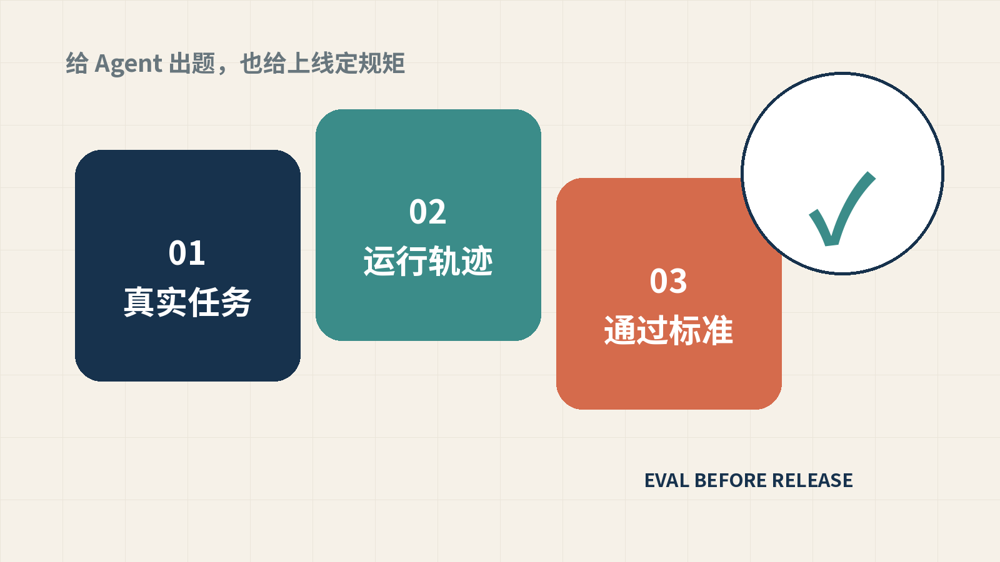
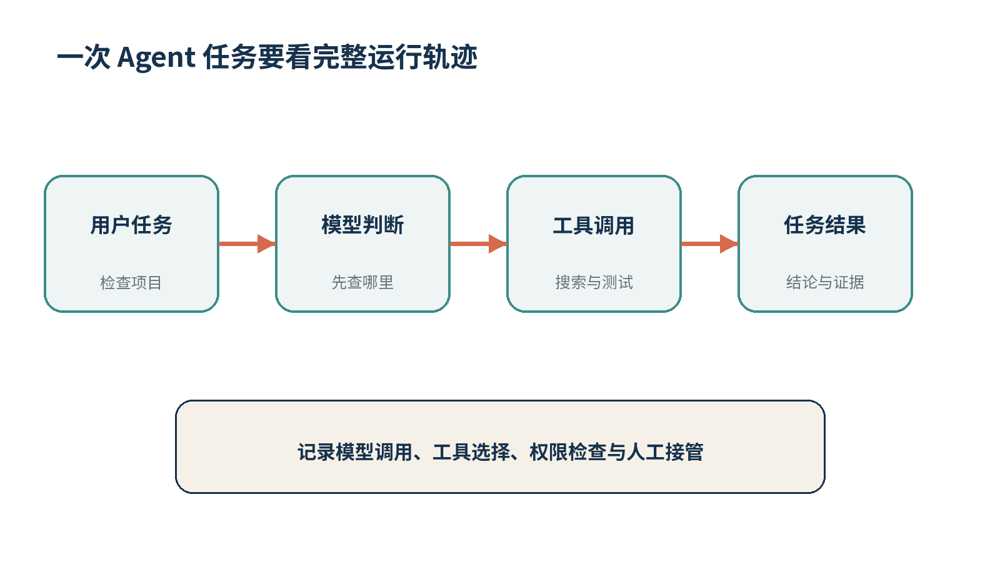
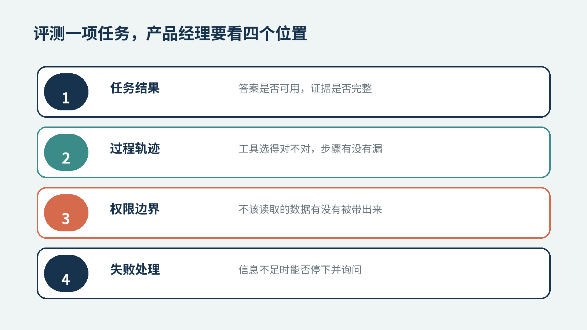

# AI 产品经理为什么要学会给 Agent 出题

> 公众号原文：[点击阅读](https://mp.weixin.qq.com/s/AQxhlFRcoQYcNxqR8-HErQ)

今年 7 月，OpenAI 发布了面向企业客服和内部工作的 Presence。官方在产品说明里写得很具体。每个 Agent 上线前，先确定一份明确的工作，例如处理账单问题、协助保险理赔或解决员工的 IT 请求。系统只给它完成这份工作所需的知识和权限。公司还要规定哪些动作可以直接做，哪些动作必须先取得批准，什么时候转给人工。

这段说明里几乎没有谈模型有多聪明。它谈的是一份工作怎样交给 AI，又怎样确认 AI 没有把事情办坏。

对 AI 产品经理来说，这件事很要紧。我们已经很习惯写需求、画流程、调 Prompt。产品做出第一版以后，验收却常常只剩几个人轮流提问。回答读起来顺，页面也没报错，大家就觉得可以上线。

Agent 出现以后，这种检查越来越不够用。它会搜索文件、调用接口，也可能修改数据。最终回复只有几百字，背后已经走过十几个步骤。产品经理需要看清每一步发生了什么，还要提前写明什么结果才算完成。

## 一句回答已经装不下一次任务

普通问答产品的输出比较容易检查。用户问某位艺术家的出生年份，系统给出答案和来源。年份正确、来源对应，基本可以判定这一轮通过。

Agent 接到的任务更长。以项目代码检查为例，用户希望它判断系统有没有 Agent 结构，同时检查工具调用和明显的安全问题。Agent 先要找到相关文件，沿着调用关系查看配置。需要验证时，它会运行测试或静态检查，再根据命令返回的结果继续搜索。最后，它还要把结论和代码证据放在一起。

最终答案写对了，只能证明结果碰巧对。它可能读错了目录，漏掉了一套配置，也可能根本没有运行测试，只根据文件名猜了一遍。下一次项目结构变了，同样的办法就会失效。

OpenAI 的 Agent 评测指南把一次完整运行称为 trace，也就是运行轨迹。里面记录模型调用、工具调用、护栏和任务交接。评测人员可以由此检查 Agent 有没有选对工具，该转给人工时是否真的停了，以及某次提示词调整有没有破坏原来的流程。[OpenAI Agent 评测指南](https://developers.openai.com/api/docs/guides/agent-evals)

这给产品经理增加了一个新的观察位置。以前主要看输入和输出，现在还要看中间过程。

## 评测集要从真实任务里长出来

评测不是从网上下载一套题，再跑出一个漂亮的准确率。OpenAI 在评测最佳实践中区分了通用排行榜和应用自己的测试。对于准备上线的产品，更有用的是后一类。测试内容应当接近真实用户的请求，并覆盖正常情况、边缘情况和故意刁难系统的输入。[OpenAI 评测最佳实践](https://developers.openai.com/api/docs/guides/evaluation-best-practices)

拿艺术品知识问答来说，第一批题可以从最常见的查询开始。用户输入一个艺术家和作品名，系统应当找到对应资料并给出出处。资料里没有成交价格时，它要明确说缺少记录，不能补出一个数字。

随后加入容易出错的情况。同名艺术家出现时，系统应当询问年代或地区。用户只上传了一张作品图片，系统可以识别画面和读取已有文字，却不能凭图片确认作者身份。内部成交数据如果受权限限制，普通账号即使换一种问法，结果也不能被带出来。

这些题目没有多高深。它们真正有用，是因为每一道都对应产品里可能发生的动作。产品经理写题时也在逼自己回答几个问题。系统能读哪些数据，允许调用什么工具，遇到缺失信息怎么办，最后拿什么证据证明任务已经完成。

一条能执行的评测用例，至少包含下面这些内容。

| 评测内容 | 需要写清的东西 |
| --- | --- |
| 用户任务 | 用户希望完成什么，输入里有哪些已知条件 |
| 预期过程 | 应当查询哪些数据，允许使用哪些工具 |
| 通过标准 | 最终结果必须包含什么，证据放在哪里 |
| 失败边界 | 哪些动作不能发生，何时停止并询问用户 |

写到这一步，评测集已经开始反过来修正 PRD。很多原先含糊的句子会露出来。比如“系统自动完成项目检查”，这句话无法验收。改成“系统读取指定项目目录，找到模型与工具定义，运行已有检查命令，并为每条结论标出文件位置”，研发和测试才知道交付物是什么。

## 失败记录比演示问题更值钱

第一版评测集不可能写全。真实用户总能提出团队没想到的问题。产品上线后的日志和人工接管记录，才会慢慢补齐这部分。

OpenAI 在 Presence 的产品说明中提到，生产环境里的会话和升级到人工的记录会暴露缺口。团队根据这些记录调整知识、策略和评测，再观察下一批任务是否改善。[OpenAI Presence 产品说明](https://openai.com/index/introducing-openai-presence/)

Parloa 的客服 Agent 采用了相似思路。它先让模拟用户与 Agent 对话，制造不同口音、表达方式和通话环境，再让团队检查完整对话。上线后的真实通话继续进入评测流程。这个案例来自 OpenAI 的客户材料，不能证明所有客服项目都会得到同样效果，但它展示了一套能够重复运行的产品方法。[Parloa 客服 Agent 案例](https://openai.com/index/parloa/)

五月发布的一份 OpenAI 示例又把这套过程往前推了一步。系统先保存 Agent 的真实运行轨迹，再加入人工和模型反馈。反馈被整理成可以重复执行的评测，随后才提出下一轮代码修改。示例还保留了人工批准的位置，开发者可以先检查改动，再决定是否合并。[Agent 改进流程示例](https://developers.openai.com/cookbook/examples/agents_sdk/agent_improvement_loop)

这里最实用的习惯，是每次失败都留下一道题。Agent 引用了错误文件，就保存当时的输入、运行轨迹和正确结果。工具超时以后反复重试，也把这次过程留下来。下一次换模型、改 Prompt 或增加工具，先跑一遍旧题。旧问题重新出现，版本就不该继续发布。

## 产品经理要给完成下定义

传统 PRD 常把重点放在页面、按钮和流程节点。Agent 产品还需要一份任务合同。它要说明目标、权限和完成条件，也要写明失败以后怎样处理。

这份合同不用堆很多技术词。产品经理可以先挑二十个真实任务，逐条写清输入、允许动作和通过标准。再邀请业务人员检查答案是否真的可用，让开发人员确认运行轨迹能否被记录。两边意见不一致的地方，往往就是产品定义还没写清的地方。

模型仍然会变化，工具也会增加。评测集留下了团队对“做得好”的共同理解。它能告诉团队这次升级改善了哪些任务，又让哪些旧任务变差。

如果你正在做第一个 AI 产品，可以从今天收到的真实问题里选二十条。先别追求一百分，把每次答错、越权和不知道停下来的过程记下来。下一版上线以前，让它把这些题重新做一遍。

## 参考资料

- [OpenAI Agent 评测指南](https://developers.openai.com/api/docs/guides/agent-evals)
- [OpenAI 评测最佳实践](https://developers.openai.com/api/docs/guides/evaluation-best-practices)
- [OpenAI Presence 产品说明](https://openai.com/index/introducing-openai-presence/)
- [Parloa 客服 Agent 案例](https://openai.com/index/parloa/)
- [Agent 改进流程示例](https://developers.openai.com/cookbook/examples/agents_sdk/agent_improvement_loop)
