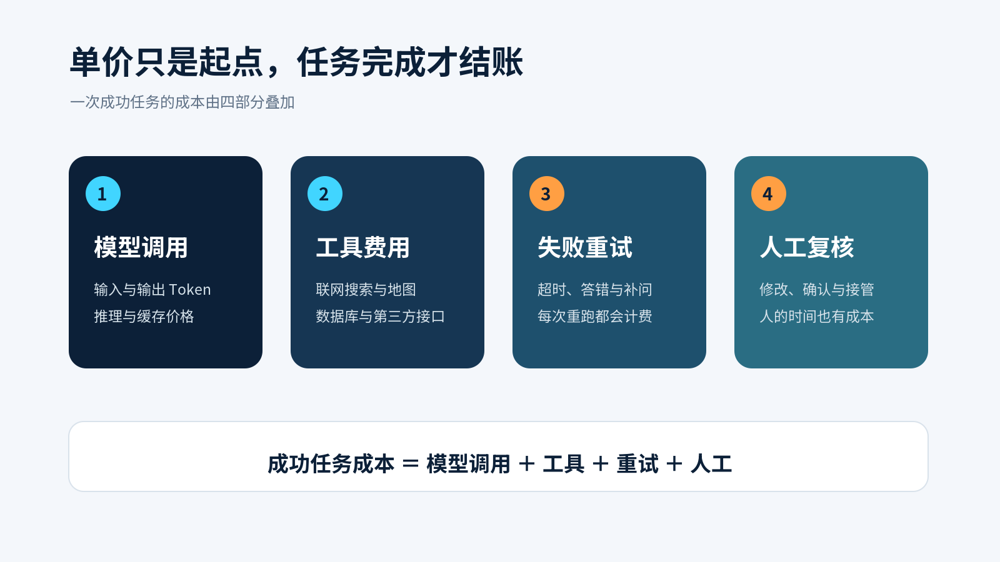
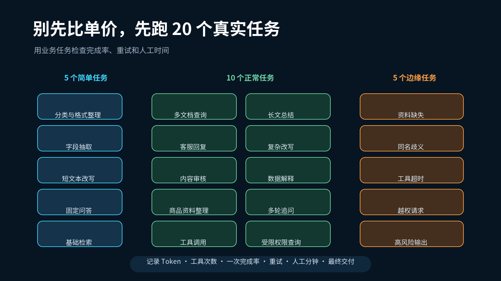

# 模型又降价了，AI 产品经理该重算哪一笔账

八月的大模型价格表改得很勤。

8 月 10 日，Anthropic 把 Claude Sonnet 5 的优惠价长期保留下来，每百万输入 Token 2 美元，输出 Token 10 美元。7 月 30 日，OpenAI 把 GPT-5.6 Luna 的价格下调 80%，Terra 下调 20%。到了 8 月 21 日，GPT-5.6 Sol 的 API 与额度价格又降了两成以上，优惠至少持续三个月。[Anthropic 产品公告](https://www.anthropic.com/news/claude-sonnet-5) [OpenAI 模型公告](https://openai.com/index/gpt-5-6/)

价格下降当然是好事。做 AI 产品的人也很容易顺手做出一张表，把几家模型的输入价、输出价和上下文长度并排放好，挑出看起来便宜的一项。

问题出在项目上线以后。账单按调用来收，用户只为完成任务买单。模型回答失败一次，系统重新调用一次，钱就多花一份。答案勉强能用，运营人员改了十分钟，这十分钟也在项目成本里。产品经理如果只抄每百万 Token 的价格，最后算出来的预算通常很整齐，也很不准。

## 一张单价表算不出项目预算

先算一笔最简单的账。

假设一次知识库问答输入 1.2 万 Token，输出 2000 Token。按 Claude Sonnet 5 当前公开价格计算，一次调用约为 0.044 美元。一天一万次调用，单看模型费用约为 440 美元。

这个数字只说明请求成功发送并返回了内容。它没有告诉我们答案有没有引用错资料，也没有算第二次重试、联网搜索、向量检索和人工复核。

连 Token 本身也未必能直接横着比。Anthropic 的迁移文档提醒，Sonnet 5 的新分词器对同一段文本大约会产生 30% 更多 Token，实际变化取决于内容。它的每 Token 单价低于上一代，可同一个请求的费用不会按价格降幅等比例下降。[Anthropic 迁移说明](https://platform.claude.com/docs/en/models/sonnet-5/whats-new-sonnet-5)

这类细节很容易被产品方案漏掉。大家看到模型便宜了，先把调用量放大十倍，月底才发现输入文本也变长了，输出里的思考 Token 增多了，原先的预算没有跟着业务一起长。

*图 1　一次成功任务的成本由模型、工具、重试和人工共同组成。本文整理。*

## 工具、速度和缓存都有自己的价格

Agent 产品尤其容易漏算工具费。

Google 的 Gemini API 价格页把模型 Token 和联网工具分开计价。Gemini 3 系列使用 Google Search，前 5000 次搜索请求免费，之后每 1000 次收费 14 美元。一次用户请求可能触发多次查询，每次查询都可能计费。Google 还写明，Gemini 3.7 Flash 当前的优惠价持续到 2026 年 12 月 31 日，2027 年 1 月 1 日起，输入、输出与缓存价格都会调整。[Google Gemini API 价格页](https://ai.google.dev/gemini-api/docs/pricing)

速度也是一项选择。OpenAI 在 7 月 30 日的说明中提到，GPT-5.6 Sol 的 Fast 模式最高可达到标准处理的 2.5 倍速度，价格则是两倍。[OpenAI 价格调整说明](https://openai.com/index/advancing-the-price-performance-frontier-with-gpt-5-6/)

这笔钱是否值得，要看用户等不起的那几秒会不会造成损失。客服坐席正在和客户通话，等待很贵。夜间批量整理一万条商品资料，多等半小时通常没有关系。产品经理要先认清任务，再选速度。

缓存也没有一句“打开就省钱”那么简单。Anthropic 文档显示，5 分钟缓存写入按基础输入价格的 1.25 倍计费，1 小时写入按两倍计费，命中缓存才会大幅便宜。批处理可以和缓存折扣叠加，可缓存命中率会随流量形态变化。Anthropic 给出的常见范围从 30% 到 98%，跨度很大。[Anthropic 缓存文档](https://platform.claude.com/docs/en/build-with-claude/prompt-caching) [Anthropic 批处理文档](https://platform.claude.com/docs/en/build-with-claude/batch-processing)

如果产品每天反复读取同一份制度、同一套商品目录，缓存很可能有用。每次输入都完全不同，写入费用可能先发生，便宜的命中却没有等来。

## AI 产品经理要算成功任务成本

我更建议把成本单位从“一次调用”换成“一次成功任务”。

可以先用一条很朴素的式子。

> 成功任务成本 ＝ 模型调用费 ＋ 工具费 ＋ 失败重试费 ＋ 人工复核费

这条式子不复杂，难处在于把每一项记录下来。第一版产品不需要上百道测试题。先从业务里挑 20 个常见任务，五个简单任务、十个正常任务、五个容易出错的任务，已经能看出很多问题。

每次测试留下六个数字。输入与输出 Token、工具调用次数、任务是否一次完成、重试次数、人工修改分钟数、最终是否可交付。

*图 2　二十个真实任务比一张模型单价表更接近产品预算。本文整理。*

最后比较的对象也要换。模型 A 每次调用便宜一半，却有三成任务需要重试。模型 B 单次费用更高，一次完成率更稳。两者谁省钱，要等人工修改时间也进表以后才能回答。

## MVP 不必只押一个模型

模型降价给产品设计带来的好处，是路由空间变大了。

分类、字段抽取、格式整理这类高频任务，可以先交给便宜模型。合同审查、复杂方案和关键客户回复，可以转给能力更强的模型。系统发现资料不足、工具连续失败或输出没有通过规则检查时，再升级模型或交给人工。

这种安排需要产品经理把任务分层。哪些错误只是多改两分钟，哪些错误会造成错误付款、数据泄露或客户投诉。风险不同，愿意支付的模型成本也不同。

PRD 里的预算部分可以增加一页，写清日调用量、平均输入长度、平均输出长度、工具次数、预期重试率和人工复核时间。价格后面再加生效日期。Google 已经公开写出明年调价时间，OpenAI 的 Sol 价格又带着优惠期限。把今天的单价当成长久条件，半年后的商业测算很容易失真。

模型价格还会继续变。产品经理今天能做的，是拿出二十个真实任务，把完成率、重试、工具和人工一起记下来。算完这张表，再决定哪个模型应该站在产品的第一道入口。

## 关键来源

- [OpenAI GPT-5.6 模型与价格更新](https://openai.com/index/gpt-5-6/)
- [OpenAI Luna 与 Terra 价格调整说明](https://openai.com/index/advancing-the-price-performance-frontier-with-gpt-5-6/)
- [Anthropic Claude Sonnet 5 公告](https://www.anthropic.com/news/claude-sonnet-5)
- [Anthropic Sonnet 5 迁移与计费说明](https://platform.claude.com/docs/en/models/sonnet-5/whats-new-sonnet-5)
- [Google Gemini API 价格页](https://ai.google.dev/gemini-api/docs/pricing)
