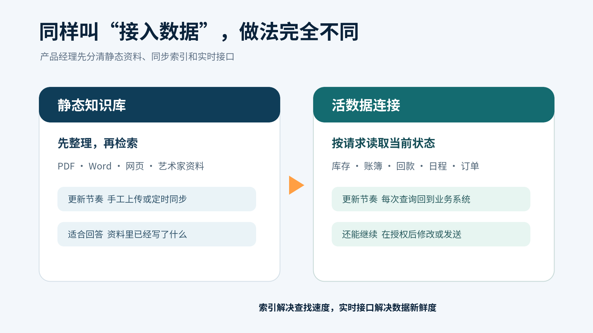
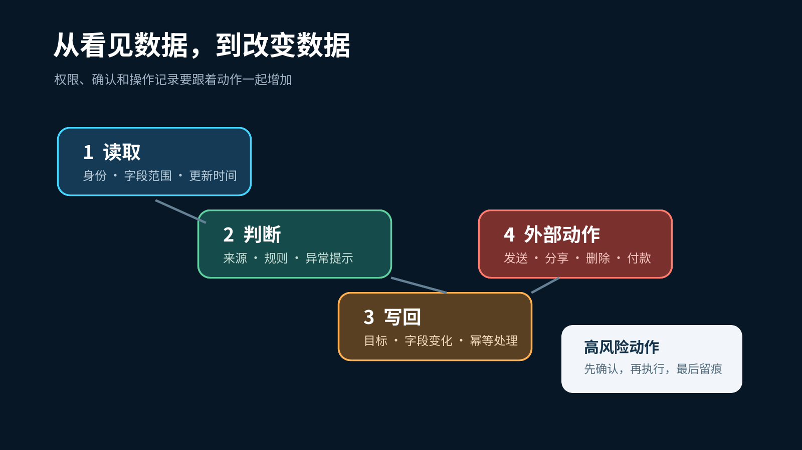

# RAG 走到下一步，AI 产品经理要开始管“活数据”了

8 月 19 日，财务软件公司 Xero 宣布把实时财务数据接入 Microsoft 365、Claude 和 ChatGPT。用户以后可以在常用的 AI 工具里查看账簿健康度、月末准备情况和现金流变化，不必先把报表导出来再上传。[Xero 官方公告](https://www.xero.com/us/media-releases/new-ai-innovations-xerocon-denver/)

这个变化很适合拿来理解 RAG 的下一步。

过去两年，很多 AI 产品的知识库流程很相似。把 PDF、Word 和网页切成小段，转成向量，用户提问时找回相关段落，再交给模型回答。这个办法很适合公司制度、产品说明和艺术家资料。内容相对稳定，来源也能提前整理。

业务数据却一直在变。上午九点的待收款清单，下午可能已经过期。作品刚入库，成交状态和库存位置就会变化。模型即使完整读过昨天导出的表格，也回答不了“现在还有哪些款项没收回来”。

## 上传文件解决不了数据的新鲜度

静态知识库最擅长回答“这是什么”。制度怎么规定，某位艺术家的履历有哪些，产品手册里写了什么，都可以从已经整理好的材料里找答案。

实时业务问题会多问两步。现在是什么状态，接下来允许做什么。

Xero 这次公布的功能就在处理这两步。系统会标出未对账项目、重复记录、缺失文件和异常项，账簿修改后，结果随之更新。它还会自动匹配高置信度的银行交易，把例外留给人工。Xero 称该功能上线以来已经自动核对超过一亿笔交易。这个数字来自公司自己的产品材料，可以证明使用规模，不能直接推算每家企业的收益。[Xero 产品说明](https://blog.xero.com/product-updates/xerocon-denver-2026-agentic-workflows-ai-era/)

这里已经出现三种不同的数据工作。系统要读取当前账簿，判断哪些记录异常，还要在用户确认后修改业务状态。只写一句“接入企业知识库”，研发很难知道该做索引、调接口，还是准备一个能写回数据的工具。

*图 1　静态知识库回答已有材料，活数据连接还要处理当前状态与业务动作。本文整理。*

## 同一个连接里也有两套数据方式

OpenAI 最近调整连接应用的方式，也把这个区别说得很清楚。

8 月 10 日起，ChatGPT Enterprise 和 Edu 不再开放新的个人同步连接，8 月 14 日开始关闭已有的个人同步。管理员管理的 Google Drive 和 SharePoint 同步仍然保留，GitHub 则转向非同步插件。[OpenAI 企业版更新说明](https://help.openai.com/en/articles/10128477-chatgpt-enterprise-edu-release-notes)

OpenAI 在更新后的 Google Drive 说明里，把同步索引和实时访问分开了。管理员可以选择一部分 Drive 内容建立工作区索引，方便成员快速检索。个人连接提供实时访问，AI 读取的是这个账号当下有权限打开的文件。创建、修改、移动、分享或删除文件，还要另外取得相应权限，有些动作会再次请用户确认。[OpenAI Google Drive 连接说明](https://help.openai.com/en/articles/10929079-google-drive-app-and-setup-in-chatgpt)

对产品经理来说，这不是一个技术名词的差别。

同步索引追求找得快，需要关心多久更新一次、删除内容何时从索引消失。实时访问追求拿到最新状态，需要关心接口速度、账号失效和权限错误。允许写回以后，产品还要说明哪些动作自动执行，哪些动作先给用户看一眼。

Google 8 月 12 日公布的新一批 Gemini 连接应用也在往动作方向走。功能将在数周内陆续开放，范围包括用 Wix 编辑网站、通过 Ticketmaster 搜索门票、预订餐厅和租车，以及使用 Zocdoc 预约医生。现阶段能确认的是产品计划与分批开放状态，还没有大规模任务成功率数据。[Google Gemini 连接应用公告](https://blog.google/innovation-and-ai/products/gemini-app/new-connected-apps-services-gemini-august-2026/)

当 AI 从“找一段资料”走到“替用户改一个东西”，产品的风险也跟着变了。

## 权限要写进产品流程

很多 PRD 会写角色权限，却没有写 AI 代表谁访问数据。

一个艺术品内部助手可以用来说明问题。策展人员能查看艺术家资料和展览记录，财务人员还能查看成交金额与回款状态。两个人问同一件作品，系统返回的字段应该不同。模型本身没有决定权，结果取决于当前用户、连接账号和原系统共同允许的范围。

如果助手只生成作品介绍，读权限已经够用。它准备修改作品状态、导出成交表或向客户发送材料时，风险会再升一级。产品应当在执行前展示目标对象、将要修改的字段和影响范围，让用户确认。执行以后还要留下时间、操作者、参数和结果。

OpenAI 9 月更新的管理说明把控制拆成几层。管理员可以决定谁能使用某个连接，连接允许哪些动作，以及在什么情况下需要再次询问用户。这几层分别处理“谁能进”“能做什么”和“什么时候停下来确认”。[OpenAI 应用管理说明](https://help.openai.com/en/articles/11509118-admin-controls-security-and-compliance-for-plugins-and-apps)

*图 2　读取、判断和写回的风险逐级增加，确认与留痕也要跟着增加。本文整理。*

## AI 产品经理要补上五个字段

下一次写 RAG 或企业助手 PRD，可以先给每个数据源补五项信息。

第一项写数据类型。它是稳定文档、定时同步的索引，还是每次请求都要读取的实时记录。

第二项写新鲜度。库存可以容忍延迟几分钟，付款状态可能要求每次查询都回源。产品要给出能接受的时间差。

第三项写身份。系统使用当前用户的账号、企业服务账号，还是一套共享凭证。身份不同，可见数据也不同。

第四项写动作。哪些接口只读，哪些会新增、修改、发送或删除。动作失败以后是否重试，重复执行会不会产生两笔记录。

第五项写确认与留痕。高风险动作在哪里停下来，用户看到什么，执行结果怎样被查回。

Google 8 月 24 日发布的 Workspace MCP 教程已经允许开发者把 Gmail、Drive、Docs、Sheets、Calendar 等服务接入开发工具。它目前属于开发者预览，需要加入预览计划，企业环境还要由管理员允许对应服务。[Google Workspace MCP 教程](https://codelabs.developers.google.com/google-workspace-mcp-antigravity)

连接越来越容易，产品定义反而要写得更细。做第一版时，可以先选一类稳定资料和一个只读的实时接口。把资料来源、更新时间、用户身份和失败提示跑顺，再增加写回动作。

如果你正在做艺术品知识问答，下一版先挑一个具体问题。用户问“这件作品现在能不能出售”时，系统需要读哪些资料，库存状态从哪里取，谁有权查看成交信息，数据拿不到时怎样回答。

这四个问题写清楚，RAG 才开始真正进入业务。

## 关键来源

- [Xero 实时财务数据与 AI 集成公告](https://www.xero.com/us/media-releases/new-ai-innovations-xerocon-denver/)
- [Google Gemini 新连接应用公告](https://blog.google/innovation-and-ai/products/gemini-app/new-connected-apps-services-gemini-august-2026/)
- [OpenAI 企业版连接调整说明](https://help.openai.com/en/articles/10128477-chatgpt-enterprise-edu-release-notes)
- [OpenAI Google Drive 同步与实时访问说明](https://help.openai.com/en/articles/10929079-google-drive-app-and-setup-in-chatgpt)
- [Google Workspace MCP 教程](https://codelabs.developers.google.com/google-workspace-mcp-antigravity)
